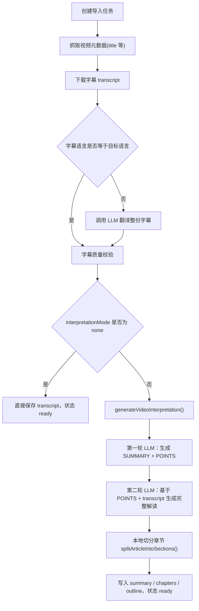
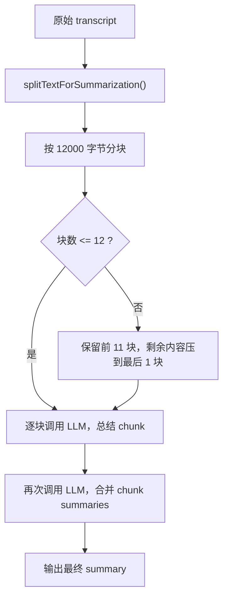
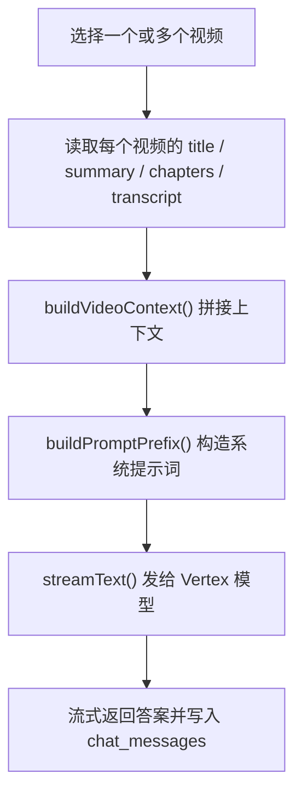

# Professor 视频导入与解读处理流程说明

本文档说明当前 Professor 项目中，视频从导入到字幕获取、翻译、解读、问答的实际处理流程，并明确长视频场景下的边界与风险。

适用代码基线：

- [lib/import/processVideoImport.ts](/Users/xipilabs/dev/Experiment/Professor/lib/import/processVideoImport.ts)
- [lib/openai/videoInterpretation.ts](/Users/xipilabs/dev/Experiment/Professor/lib/openai/videoInterpretation.ts)
- [lib/openai/summarizeVideo.ts](/Users/xipilabs/dev/Experiment/Professor/lib/openai/summarizeVideo.ts)
- [pages/api/chat.ts](/Users/xipilabs/dev/Experiment/Professor/pages/api/chat.ts)

## 1. 总体结论

当前系统里有两条容易混淆的内容处理链路：

1. 主导入解读链路

- 用于视频导入后自动生成 summary / chapters / outline
- 实际只调用 LLM 两次
- 字幕会在进入 LLM 之前先按字节数截断

2. 旧的分块总结链路

- 位于 `summarizeVideo.ts`
- 会按 `12000` 字节分块，最多 `12` 块
- 这是另一条总结能力，不是当前视频导入主链路

另外，问答链路会把 `summary + chapters + transcript` 一起注入上下文，目前没有做长度预算或检索裁剪。

## 2. 主导入解读链路

入口：

- [lib/import/processVideoImport.ts](/Users/xipilabs/dev/Experiment/Professor/lib/import/processVideoImport.ts)

主流程如下：



### 2.1 字幕获取

不同来源使用不同抓取器：

- Bilibili：`BBDown`
- YouTube / Douyin：`yt-dlp`

相关代码：

- [lib/import/processVideoImport.ts](/Users/xipilabs/dev/Experiment/Professor/lib/import/processVideoImport.ts)

如果字幕下载失败，流程直接报错结束，不进入下一步。

### 2.2 翻译

如果字幕语言和目标语言不一致，会先翻译字幕：

- [lib/openai/translate.ts](/Users/xipilabs/dev/Experiment/Professor/lib/openai/translate.ts)

这里是一次单独的 LLM 调用，输入是整份字幕文本，不做分块。

注意：

- 这里 `maxOutputTokens = 12000`
- 当前没有分块翻译逻辑

所以超长字幕在翻译阶段也可能出现慢、失败或输出不完整的问题。

### 2.3 主解读

主解读函数：

- [generateVideoInterpretation](/Users/xipilabs/dev/Experiment/Professor/lib/openai/videoInterpretation.ts)

这里有两个关键事实：

1. 当前只有两次 LLM 调用

- 第一次：`generateCoverageMap()`
- 第二次：`generateFullArticle()`

2. 字幕会在进入这两次调用前先被截断

相关代码：

```ts
function normalizeTranscript(input: string, mode: InterpretationMode) {
  const byteLimit = mode === 'detailed' ? 90000 : 30000
  return limitTranscriptByteLength(text, byteLimit)
}
```

位置：

- [lib/openai/videoInterpretation.ts](/Users/xipilabs/dev/Experiment/Professor/lib/openai/videoInterpretation.ts)

这意味着：

- `detailed` 模式：最多约 `90000` 字节
- `concise` / `extract`：最多约 `30000` 字节

也就是说，超长视频不是“生成结果被截断”，而是“送给 LLM 的字幕输入先被截断”。

### 2.4 第一次 LLM：生成 SUMMARY + POINTS

函数：

- [generateCoverageMap](/Users/xipilabs/dev/Experiment/Professor/lib/openai/videoInterpretation.ts)

输入：

- title
- 已截断的 transcript

输出要求：

- `SUMMARY:`
- `POINTS:`

POINTS 数量校验：

- `detailed` / `extract` / `concise` 都要求满足对应区间
- 不符合会触发重试

注意：

- 这里的 POINTS 只可能覆盖“截断后的字幕内容”
- 如果原视频后半段被截掉，POINTS 不可能覆盖后半段真实内容

### 2.5 第二次 LLM：生成完整解读

函数：

- [generateFullArticle](/Users/xipilabs/dev/Experiment/Professor/lib/openai/videoInterpretation.ts)

输入：

- title
- 已截断的 transcript
- 第一步生成的 POINTS

输出：

- `concise` / `detailed`：要求输出完整文章
- `extract`：要求输出 `##` + 多个 `###` 知识点

注意：

- 第二次仍然使用同一份已截断字幕
- 所以即使第二次模型表现很好，也无法补回第一步之前已经丢失的字幕内容

### 2.6 大纲不是第三次 LLM 调用

当前实现里，大纲和章节不是再次调用模型生成。

处理方式：

- 把第二步生成的文章按标题切开
- 章节来自 `##` 或 `###`

相关函数：

- [splitArticleIntoSections](/Users/xipilabs/dev/Experiment/Professor/lib/openai/videoInterpretation.ts)

因此当前主链路不是“3 次 LLM 调用”，而是：

1. 生成 `SUMMARY + POINTS`
2. 生成完整解读
3. 本地拆分为章节与 outline

## 3. 旧的分块总结链路

文件：

- [lib/openai/summarizeVideo.ts](/Users/xipilabs/dev/Experiment/Professor/lib/openai/summarizeVideo.ts)

这条链路和主导入解读链路不同。

流程如下：



分块参数：

- 每块最大 `12000` 字节
- 最多 `12` 块

相关代码：

- [lib/openai/summarizeVideo.ts](/Users/xipilabs/dev/Experiment/Professor/lib/openai/summarizeVideo.ts)

因此：

- `12000` 和 `12` 不是主解读链路的参数
- 它们属于另一条旧的“分块总结”流程

## 4. 问答链路

文件：

- [pages/api/chat.ts](/Users/xipilabs/dev/Experiment/Professor/pages/api/chat.ts)

流程如下：



关键点：

- `buildVideoContext()` 会直接拼接：
  - `Title`
  - `Summary`
  - `Chapters`
  - `Source Text`
- 这里的 `Source Text` 就是保存到数据库里的 transcript

相关代码：

- [pages/api/chat.ts](/Users/xipilabs/dev/Experiment/Professor/pages/api/chat.ts)

当前没有看到：

- transcript 长度控制
- token 预算
- 基于章节的检索裁剪
- RAG 召回

这意味着，如果视频很长，或者一次选了很多资源：

- 问答延迟会明显增加
- 模型可能忽略后部内容
- 极端情况下可能报错或响应质量下降

## 5. 长视频超过 2 小时时的真实影响

### 5.1 对字幕导入

只要上游字幕抓取器能拿到文本，导入本身未必失败。

但风险包括：

- 字幕下载慢
- 翻译阶段慢或失败
- 存储与前端渲染更重

### 5.2 对主解读

这是当前最明确的问题。

因为主解读在进入 LLM 前就会先截断字幕：

- `detailed` 约 `90000` 字节
- 其它模式约 `30000` 字节

所以长视频会出现：

- 只覆盖前面一部分内容
- 中后段内容缺失
- POINTS 看起来结构完整，但其实不是对全视频的完整覆盖

### 5.3 对旧总结链路

旧总结链路比主解读链路更稳，因为它会分块。

但仍然不是完全无上限：

- 超过 `12` 块后，尾部会再压缩
- 内容越长，信息密度越不均匀

### 5.4 对问答

这是另一个高风险点。

因为当前问答会把完整 transcript 拼进上下文，而不做裁剪或检索：

- 资源越长，越慢
- 多视频一起问时更容易超长
- 回答可能偏向前部内容

## 6. 当前链路中的关键边界

### 6.1 主解读不是全量语义覆盖

当前方案本质上是：

- 先截断
- 再做两轮解读

因此它不适合被理解为“对超长视频做全量、完整、均匀覆盖”。

### 6.2 分块总结和主解读是两套机制

不能把下面两件事混为一谈：

1. `videoInterpretation.ts`

- 主导入解读链路
- 截断后两次调用

2. `summarizeVideo.ts`

- 旧分块总结链路
- `12000 * 12`

### 6.3 大纲不是独立建模步骤

当前 outline/chapter 来自第二步解读结果的本地拆分，不是单独一次模型推理。

## 7. 一句话结论

如果视频超过 2 小时、字幕很多，当前系统的核心问题不是“最终解读输出被截断”，而是：

- 主解读链路在进入 LLM 前就先把字幕截短了
- 旧总结链路才有 `12000 * 12` 的分块机制
- 问答链路目前会直接拼完整 transcript，长内容下会越来越重
